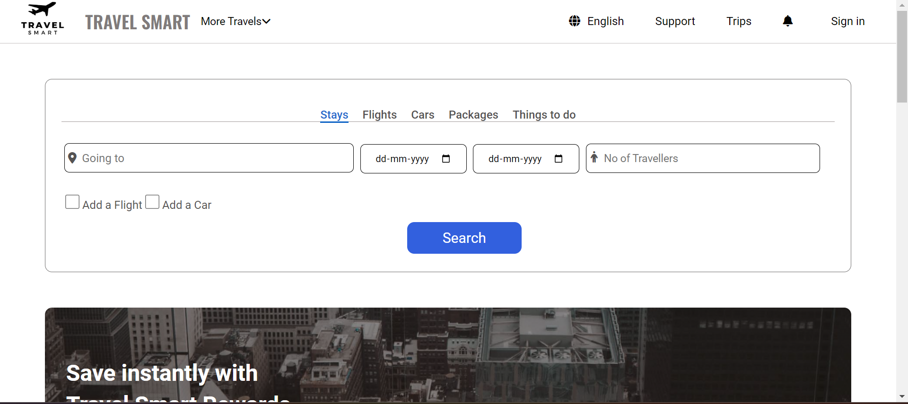
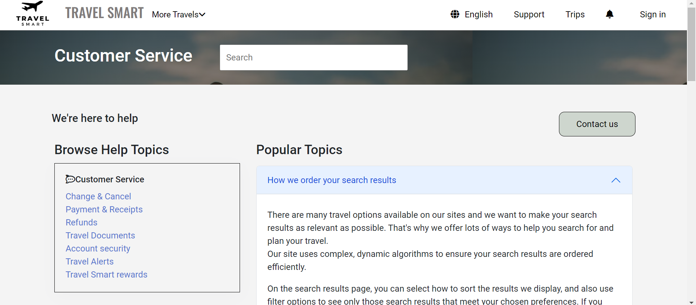
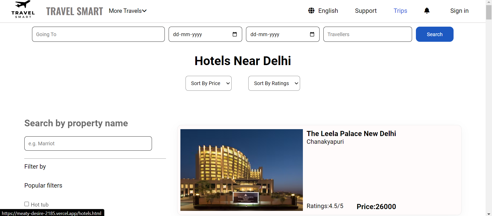
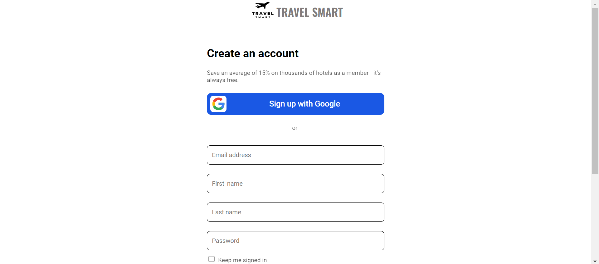
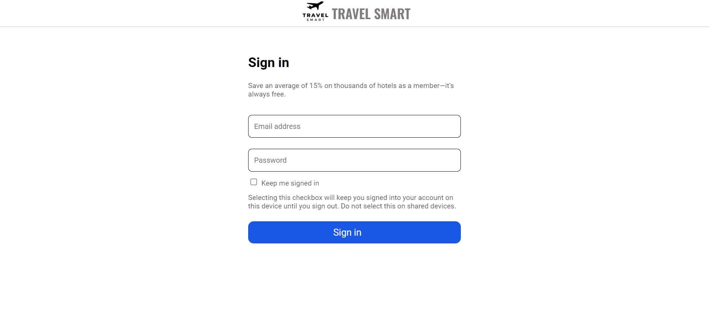

# Travel Smart - Expedia.com Clone 

Expedia Group, Inc., headquartered in Seattle, owns and operates travel fare aggregators and travel metasearch engines, including Expedia.com, Hotels.com, Vrbo, Travelocity, Hotwire.com, Orbitz, Ebookers, CheapTickets, CarRentals.com, Expedia Cruises, Wotif, and Trivago. Over 3 million lodging facilities and flights on over 500 airlines are bookable on the company's websites.

# Tech Stack
- Javascript
- HTML
- CSS

# Functionalities

- Landing Page
- Accordian inside the support page
- Sign Up and Sign in
- Trips Page For Hotels
- Filter and Sorting
- Searching of hotels by Name and Area
# Landing Page

 

 

# Support Page

# Trips Page

# Sign up Page

# Sign in Page

Thank You for visiting
-----

